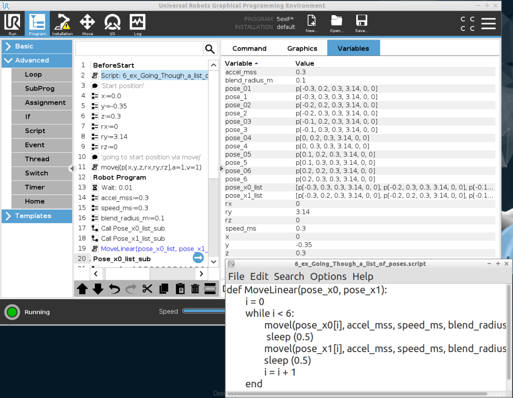

# UR-Scripting by example

A short GitHub to give en example how to write and use UR-script in the UR-Polyscope enviorment.

## Test platform
All code have been tested on version polyscope version:

CB3: 3.15.4

E-series: 5.11

Robot platform : UR3 and UR3e

You can either test it on the Offline simulator (download that from UR Homepage or [here (updated last 02022022)](https://ucndk-my.sharepoint.com/:f:/g/personal/hgr_ucn_dk/Ei5tqgtmOvFCqEWAVZdYMiABk1DubYUFo2dtYdXqdPlfDw?e=bKitJm)
## Code and examples
Under the folder [UR Script](UR_Script) you will finde the script files used in the following examples.
Under the folder [UR Code](UR_Code) you will finde a file with all files to load into polyscope.
Under the folder [Manual](Manual) you will find UR-script manual in pdf format.

## How to run use functions in polyscope
Step 1:
Press "robot program" and mark the field "add Before Start Sequence", this will make first run the will not be looped. In this tab of the programming you can set up a start position, functions and other values that you want global access to.

To add a function, go to the "advanced" tab in programming, choose "Script", change the dropdown menu to "file" and press "edit". From here you can now load a file writen in UR-script ("filename".txt or .script) and you can edit the file directly in the polyscope editor (remember to press save)

When the function are loaded into the "BeforeStart" you can call it in the "Robot program" (see picture with red)

## Example 1: Function for Control Outputs from a local script file.
Hallo world in the HW world, is to control an LED, try to implement this code
```
def BlinkLed(LED):
	sleep(0.1)
	set_digital_out(LED,True)
	sleep(1.0)
	set_digital_out(LED,False)
	sleep(1.0)
end
```


## Example 2: Function with parameter transfer
Using parameteres to control a function can be importent, in this example it is used to make a "Pause" function"
```
def Pause(counter):
	while 0 < counter:
		counter = counter - 1
		sleep(0.001)
	end
end
```


## Example 3: Function with parameter transfer and make calculation and return result.
Usnge parameteres and math with return functions
```
def Calc(a, b):
	c = a + b
	global d = a - b
	return c
end
```


## Example 4: Function with move command and calculate new position for move.
Using the UR script control the robots movement, in the picture it can be seen that the robot is moved with a movej to a start position. This way of moving a UR robot eliminates the start function of robots, where a user actively needs to press on the teach pendant to move the robot into a position. At the same time, there are no safety net to help the programmer from putting the robot into an illigal position, except an error message.
```
def Move(x, y, z, rx, ry, rz, dX, dY, dZ):
	movel(p[x, y, z, rx, ry, rz], a=1, v=1)
	sleep(1.0)
	x = x + dX
	y = y + dY
	z = z + dZ
	movel(p[x, y, z, rx, ry, rz], a=1, v=1)
	sleep(1.0)
end
```


## Example 5: Function with If condition.
Using a IF condition to move the robot.
```
def If_Check(INPUT, digiIN):
	if (digiIN == False):
		if (get_standard_digital_out(INPUT) == True):
			movel(p[0.10,-0.35,0.2,0.0,3.14,0.0], a=1, v=1)
		end
		if (get_standard_digital_out(INPUT) == False):
			movel(p[-0.10,-0.35,0.4,0.0,3.14,0.0], a=1, v=1)
		end
	elif (digiIN == True):
		if (get_standard_digital_in(INPUT) == True):
			movel(p[0.0,-0.35,0.2,0.0,3.14,0.0], a=1, v=1)
		end
		if (get_standard_digital_in(INPUT) == False):
			movel(p[0.0,-0.35,0.4,0.0,3.14,0.0], a=1, v=1)
		end
	end
end
``` 


## Example 6: Function with 2 lists of poses (Each list contain 6 poses i.e. a total of 12 poses).
Using a function to run though multiple lists of postions, the position are saved in sub-programs and are loaded into the main robot program (see the picture or the example file)
```
def MoveLinear(pose_x0, pose_x1):
	i = 0
	while i < 6:
		movel(pose_x0[i], accel_mss, speed_ms, blend_radius_m)
		 sleep (0.5)
		movel(pose_x1[i], accel_mss, speed_ms, blend_radius_m)
		sleep (0.5)
		i = i + 1
	end
end
``` 


## REMEMBER
Have fun !! :) 

## Links

[Universal Robots download page](https://www.universal-robots.com/download)
 
[Zacobria Automation](https://www.zacobria.com/automation/) 
